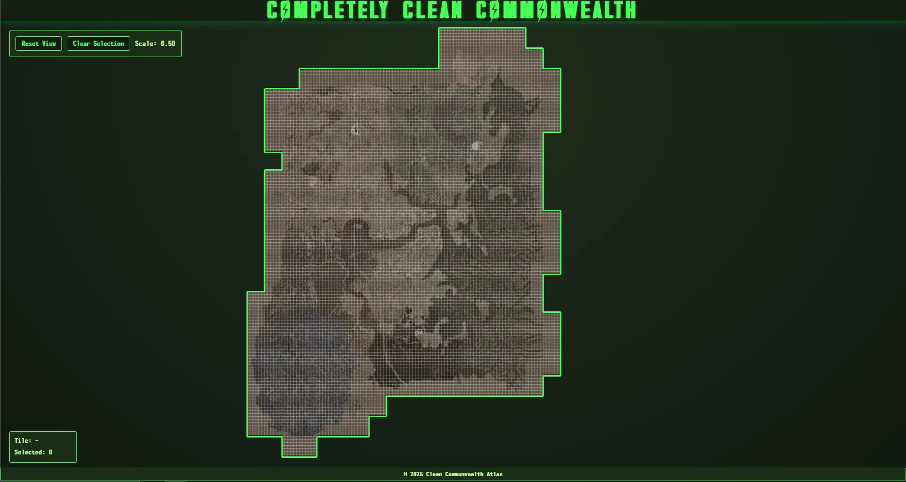

<!--
A GPU‑accelerated, Fallout 4‑themed map viewer for the Completely Clean Commonwealth mod. Built for in‑browser cell planning, annotation, and collaborative region claims.
-->

# **Completely Clean Commonwealth Cartographer**  
*A Fallout‑style, WebGL‑accelerated LOD viewer & cell‑planner*  
> *“War never changes—but your map can.”*

[](https://www.nexusmods.com/fallout4/mods/94907)   [](https://github.com/TheCascadian/TheCascadian.github.io/stargazers)   [](LICENSE.md)   [](https://github.com/TheCascadian/TheCascadian.github.io/commits/main)   [](#)

> **Asset Notice**  
> All trademarked names, images, and game content remain © Bethesda Softworks LLC (a ZeniMax Media company / Microsoft) and © their respective mod authors. This repository distributes *only* original code and derivative low‑resolution LOD tiles generated via **xLODGen** for non‑commercial, transformative use.

---

## Project Structure

```
/
├── index.html           # Entry point, sets up canvas & context menus
├── main.js              # WebGL2 rendering, pan/zoom, tile logic
├── sw.js                # Service Worker: precache + cache‑busting
├── style.css            # UI theming and context‑menu styles
├── assets/
│   ├── map-preview.webp # Preview image for README
│   ├── map.png          # Full-resolution landmask
│   └── mask.png         # Binary mask for tile culling
├── claims/              # Contributor region metadata (JSON)
├── LICENSE.md           # MIT License terms
└── README.md            # This document
```

---

## Preview

> Interactive cell‑based landmask viewer with WebGL2 navigation and annotation.



---

## Overview

The **Completely Clean Commonwealth Cartographer** is a browser‑based cell planning and tile inspection tool for Fallout 4 modders.  
No Fallout 4 install is required—runs entirely in‑browser with full GPU acceleration, precached tile assets, and live annotation tooling.

> Tested in: **Chrome** & **Edge**  
> Unknown support for Safari (WebGL2 limitations)

---

## Key Features

| Feature               | Description                                        |
|-----------------------|----------------------------------------------------|
| Fallout 4 LOD Map   | Based on *Completely Clean Commonwealth*           |
| Cell Planner        | Visual grid selection for mod claims               |
| Optimized Rendering | Fluid zoom/pan via GPU rendering                   |
| LOD Tilemap         | Generated offline with `xLODGen`                   |
| Smart Culling       | UUID‑based masking for tile interactivity          |
| GitHub Integration | Right‑click to annotate & contribute via PRs       |

---

## Capabilities

- **Pan, zoom, and inspect** the 2304 × 2688 landmask on a 4096 × 4096 canvas.  
- **Cell‑accurate selection** mirroring Fallout 4’s worldspace grid.  
- **Auto‑masked tiles** via binary mask (`mask.png`)—non‑navigable areas are blocked.  
- **Right‑click context tools**: annotate, label, purge cache, generate PR regions.  
- **Offline‑resilient**: Service Worker + IndexedDB ensure smooth navigation on flaky networks.  
- **Incremental builds**: UUID cache‑busting prevents stale tile reuse.  
- **Drop‑in ready**: 100 % GitHub Pages‑compatible—deploy static host with zero config.

---

## Get Started

```bash
git clone https://github.com/TheCascadian/TheCascadian.github.io
cd TheCascadian.github.io
# OPTIONAL: local server for Service Worker scope
npx serve .
```

---

> **Want to reserve and annotate your own grid section?**  
> [Claim a region](https://github.com/TheCascadian/TheCascadian.github.io/tree/main/claims) in 3 steps:  
> 1. **Fork** the repository  
> 2. **Select** your tile(s) via the live viewer  
> 3. **Submit** a pull request with your grid metadata  
>
> Every square claimed helps make the Commonwealth a little less... *empty*.

---

## Credits & Attribution

Created by **@TheCascadian** for the *Completely Clean Commonwealth* project.  
Inspired by:  
- **Necesse** (grid planning & world visualization)  
- **xLODGen** (LOD tile generation)  
- **Pixel‑art editors** (manual annotation UX)

> *This is a companion tool for the CCC mod—not a Fallout 4 mod itself.*

---

## License

Licensed under the MIT License.  
Free for use, modification, and distribution with attribution. See [TheCascadian.github.io/LICENSE.md](LICENSE.md).

---

## Developer Notes

- **mask.png**: 1‑bit binary mask for tile culling logic.  
- **main.js**: Handles canvas rendering, WebGL2 setup, input & LOD logic.  
- **sw.js**: Manages precaching & UUID‑based cache invalidation.  
- **claims/**: Drop your `.json` metadata here to claim grid sections.  
- PRs welcome for UI tools, performance profiling, or annotation workflows.

> *“See the world as it was—before you rebuild it.”*
